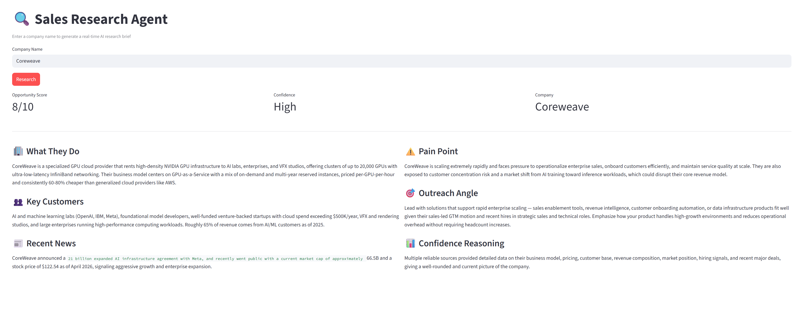

# Sales Research Agent

An autonomous AI agent that generates real-time company intelligence briefs for sales teams.

**[Live Demo →](https://sales-research-agent-bzi73dwliaf9fkpbdliop4.streamlit.app/)**



## What It Does

A sales rep types in a company name. The agent autonomously:
1. Decides what information it needs to research
2. Runs multiple targeted web searches
3. Synthesizes findings into a structured brief
4. Scores the company as a sales opportunity (1-10)
5. Flags confidence level based on data quality

What takes a junior analyst 2 hours takes this agent 30 seconds.

## Why This Is Not A Chatbot

Most AI demos just wrap a prompt around ChatGPT. This is different:

- **Agentic** — Claude decides what to search for, not hardcoded logic
- **RAG** — retrieves live web data instead of relying on training knowledge
- **Multi-model** — uses cheap Haiku for decisions, Sonnet for synthesis
- **Structured output** — consistent JSON schema every time, not freeform text
- **Cost aware** — hard search limits and model selection keep costs under $0.02/run

## Tech Stack

- **Python** — core language
- **Claude API (Anthropic)** — reasoning and synthesis
- **Tavily API** — real-time web search
- **Streamlit** — frontend UI
- **ReAct pattern** — Reasoning + Acting agent loop

## Key AI Concepts Demonstrated

- **RAG (Retrieval Augmented Generation)** — fresh data injected into model context
- **Agentic search** — model autonomously decides search queries
- **Multi-step reasoning** — search → evaluate → search again → synthesize
- **Structured output parsing** — reliable JSON extraction from LLM responses
- **Cost optimization** — tiered model usage based on task complexity

## Architecture

```
User Input (company name)
↓
Agent Loop (Claude Haiku)
→ "What do I need to know?"
→ Search web (Tavily)
→ "Do I have enough?"
→ Repeat up to 4x
↓
Brief Writer (Claude Sonnet)
→ Synthesize all findings
→ Score opportunity 1-10
→ Flag confidence level
↓
Structured Output (JSON → UI)
```

## Setup

```bash
git clone https://github.com/yourusername/sales-research-agent
cd sales-research-agent
python3 -m venv venv
source venv/bin/activate
pip install -r requirements.txt
cp .env.example .env
# Add your API keys to .env
python -m streamlit run app.py
```

## Environment Variables

```
ANTHROPIC_API_KEY=your-key
TAVILY_API_KEY=your-key
```

## Roadmap

- [ ] Batch processing — upload CSV of companies, research all overnight
- [ ] Document ingestion — upload prospect PDFs for deeper analysis
- [ ] Persistent database — track companies over time, see what changed
- [ ] Export to CSV — ranked opportunity list for sales teams
- [ ] Rate limiting — production-ready usage controls

## What I'd Do With More Time

This pattern — autonomous research → structured output → scored ranking — transfers directly to:
- Vendor risk assessment
- Competitive intelligence
- Customer churn prediction
- Investment due diligence

The agent doesn't know it's doing "sales research." It's a decision-making pipeline that happens to be pointed at companies.

## Author

Built by Henry — CS + Economics background focused on applied AI systems that extract business value from data.

[LinkedIn](https://www.linkedin.com/in/henry-greene/) | [GitHub](https://github.com/HenryGreene10)
