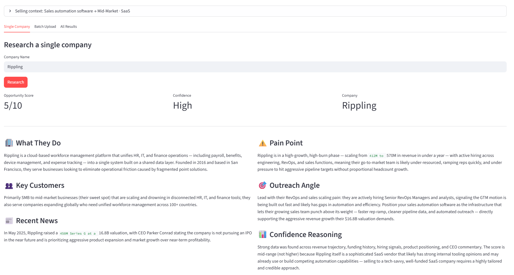

# Sales Research Agent

An agentic commercial intelligence system that turns live company signals, seller context, and evidence-backed research into ranked account briefs.

**[Live Demo →](https://sales-research-agent-bzi73dwliaf9fkpbdliop4.streamlit.app/)**



## What It Does

A sales rep defines their selling context (what they sell, target company size, industry), then types in a company name. The agent autonomously:
1. Selects which specialized tools to call (web search, job postings, SEC filings, funding news)
2. Retrieves similar past companies from its database as scoring benchmarks
3. Synthesizes findings into a structured brief
4. Scores the company 1-10 from the seller's specific perspective
5. Flags confidence level based on data quality

What takes a junior analyst 2 hours takes this agent 30 seconds.

## Current State

The current version is a strong v1 demo:

- Streamlit frontend for single-company and batch research
- Claude tool-use loop for autonomous retrieval
- Tavily-backed live search for company signals
- SQLite-backed research history and lightweight benchmark memory
- Seller-context-aware scoring and brief generation

Today the system proves the workflow. The v2 goal is to make it more trustworthy, fresher, more personalized, more inspectable, and more differentiated.

## V2 Direction

V2 upgrades this project from a demo-grade research agent into a more credible commercial intelligence product.

Core product goal:

Seller profile
→ input target accounts
→ resolve the company correctly
→ run only the right research tools
→ detect why-now opportunity signals
→ rank accounts with evidence-backed scoring
→ inspect sources, trace, and rationale
→ export results

The focus is not “more AI for its own sake.” The focus is trust, routing intelligence, provenance, personalization, and signal detection.

## Why This Is Not A Chatbot

Most AI demos just wrap a prompt around ChatGPT. This is different:

- **Agentic** — Claude decides which tools to call and when to stop, not hardcoded logic
- **Native tool use** — Claude API tool use, not string-parsed ReAct. Claude calls specialized tools (`search_web`, `get_job_postings`, `get_sec_filing`, `get_funding_news`) and declares when it has enough
- **Seller-personalized** — user defines what they sell, target size, and industry upfront; every score and recommendation is framed from that specific sales perspective
- **Memory** — past research is stored in SQLite and surfaced as benchmark context when scoring similar companies
- **Multi-model** — cheap Haiku drives the research loop; Sonnet synthesizes the final brief
- **Structured output** — consistent JSON schema every time, not freeform text
- **Cost aware** — hard tool-call limits and model tiering keep costs under $0.02/run

## Tech Stack

- **Python** — core language
- **Claude API (Anthropic)** — tool use loop (Haiku) + synthesis (Sonnet)
- **Tavily API** — real-time web search
- **Streamlit** — frontend UI
- **SQLite** — persistent company database and benchmark memory

## Key AI Concepts Demonstrated

- **Native tool use** — Claude selects and calls tools via the Anthropic tools API
- **RAG (Retrieval Augmented Generation)** — fresh web data injected into model context
- **Agentic search** — model autonomously chooses queries and specialized tools
- **Personalized scoring** — seller context shapes the scoring persona sent to Sonnet
- **DB-backed memory** — similar past companies retrieved and injected as benchmarks
- **Structured output parsing** — reliable JSON extraction from LLM responses
- **Cost optimization** — tiered model usage based on task complexity

## Architecture

### V1

```
Seller Context (what you sell, target size, industry)
↓
User Input (company name)
↓
Tool-Use Research Loop (Claude Haiku)
→ Calls: search_web / get_job_postings / get_sec_filing / get_funding_news
→ Retrieves similar companies from DB as scoring benchmarks
→ Calls finish_research when done (up to 4 tool calls)
↓
Brief Writer (Claude Sonnet)
→ Synthesizes all findings
→ Scores opportunity 1-10 from seller's perspective
→ Flags confidence level
↓
Structured Output (JSON → UI)
→ Saved to SQLite for future benchmarking
→ Exportable to CSV
```

### V2 Target

```
Seller Profile
↓
Account Input (single company or CSV)
↓
Company Resolution
→ normalize name
→ resolve domain / website
→ classify public vs private vs unknown
→ attach ticker / CIK when available
↓
Routing Layer
→ choose only relevant research tools
→ set freshness windows dynamically from runtime date
↓
Research and Evidence Collection
→ web search
→ recent news
→ jobs / hiring
→ funding / momentum
→ SEC / filings when public
→ website / positioning analysis
→ optional tech stack / competitor signals
↓
Signal Detection
→ identify why-now opportunity triggers
→ classify signals by type
→ score timing / urgency
↓
Scoring and Brief Generation
→ seller-scoped benchmark retrieval
→ evidence-backed score rationale
→ opportunity score + trigger score + confidence
↓
Inspectable Output
→ final brief
→ sources
→ tool trace
→ decision trace
→ exportable ranked results
↓
Persistence
→ seller-scoped research runs
→ evidence items
→ duplicate control
→ future watchlists / monitoring
```

## Setup

```bash
git clone https://github.com/yourusername/sales-research-agent
cd sales-research-agent
python3 -m venv venv
source venv/bin/activate
pip install -r requirements.txt
cp .env.example .env
# Add your API keys to .env
python -m streamlit run app.py
```

## Environment Variables

```
ANTHROPIC_API_KEY=your-key
TAVILY_API_KEY=your-key
```

## Features

- [x] Batch processing — upload CSV of companies, research all at once
- [x] Persistent database — SQLite tracks every company researched over time
- [x] Export to CSV — download a ranked opportunity list for your sales team
- [x] Rate limiting — session-based usage controls (production-ready)
- [x] Seller context — personalized scoring and framing per seller profile
- [x] DB-backed memory — past research used as benchmarks for new scoring
- [ ] Document ingestion — upload prospect PDFs for deeper analysis

## V2 Upgrade Plan

### 1. Company Resolution Before Research

Add `resolve_company(company_name)` before the main research loop.

Example target shape:

```json
{
  "input_name": "Stripe",
  "normalized_name": "stripe",
  "resolved_name": "Stripe, Inc.",
  "domain": "stripe.com",
  "website": "https://stripe.com",
  "company_type": "private",
  "ticker": null,
  "cik": null,
  "industry": "Financial Infrastructure",
  "confidence": 0.94,
  "evidence": []
}
```

This step determines which tools should run and improves duplicate control.

### 2. Dynamic Freshness Logic

Remove hard-coded years from search queries.

- Use the runtime date
- Prefer recent windows by tool type
- Separate recent signals from historical company context

### 3. Conditional Research Tools

Refactor research into modular tools:

- general web search
- recent news and developments
- jobs and hiring signals
- funding and company momentum
- SEC / filings for public companies
- website and product positioning analysis
- optional tech stack or competitor signal search

Tool selection should depend on resolved company type and confidence.

### 4. Evidence and Provenance Tracking

Every tool call should preserve:

- tool name
- search query
- source URLs
- retrieval timestamp
- evidence snippets

Final output should include:

```json
{
  "company": "Stripe",
  "resolved_company": {},
  "opportunity_score": 8.1,
  "trigger_score": 7.8,
  "score_rationale": "Why this account ranks well",
  "pain_points": [],
  "why_now_signals": [],
  "outreach_angle": "How to approach the account",
  "confidence": "high",
  "sources": [],
  "tool_trace": [],
  "decision_trace": [],
  "generated_at": "2026-04-29T00:00:00Z"
}
```

Scores must be explainable from evidence.

### 5. Real Seller Personalization

Move from prompt-only personalization to seller-scoped persistence.

Target entities:

- `seller_profiles`
- `companies`
- `company_aliases`
- `research_runs`
- `evidence_items`

Seller profiles should capture:

- name
- product description
- ideal customer profile
- target industries
- past wins
- disqualifiers
- created at

Research and recommendations should be scoped to that seller.

### 6. Memory Retrieval Fixes

Improve benchmark retrieval so:

- history is seller-scoped
- examples are tied to the actual selected score row
- benchmark context reflects the current seller and company type

### 7. Duplicate Control

Normalize and dedupe by:

- company name
- normalized name
- domain
- aliases
- seller scope

Avoid duplicate records unless the user explicitly requests a refresh or a stale result needs renewal.

### 8. Runtime Safety

Add:

- retries
- request timeouts
- failure isolation by tool
- graceful fallbacks
- batch fault tolerance

One failed external call should not break a full run.

### 9. Visible Agent Trace UI

Make the system inspectable in the UI:

- company resolution output
- selected tools
- searches run
- sources used
- scoring inputs
- decision trace
- final recommendation path

### 10. Keep the Workflow Focused

The primary product flow stays simple:

Seller profile
→ upload or enter target accounts
→ ranked opportunities
→ inspect one account
→ view evidence and reasoning
→ export results

### 11. Basic Test Coverage

Add tests for:

- company resolution schema
- routing logic
- seller-scoped memory
- duplicate handling
- provenance in outputs
- error handling in batches

### 12. README and Positioning

Position the project as:

> Commercial Intelligence Agent that turns live company signals, seller context, and agentic search into ranked account briefs with evidence trails and personalized opportunity scoring.

Add over time:

- architecture diagram
- screenshots
- example output
- roadmap
- live demo walkthrough

## Differentiator: Why-Now Opportunity Signals

The core v2 differentiator is not generic summarization. It is signal detection tied to sales relevance.

Signals to detect:

- recent funding rounds
- hiring spikes
- product launches
- leadership changes
- market expansions
- partnerships or acquisitions
- regulatory or macro catalysts
- messaging changes on website
- tech stack changes

Target output:

```text
Why This Account Now:
- Company increased AI hiring in the last 90 days
- New product launch suggests integration pain
- Recent funding suggests budget and urgency

Opportunity Trigger Score: 8.6/10
```

The ideal implementation is evidence-first:

1. Retrieve signals from sources
2. Classify them into typed signal categories
3. Score their sales relevance
4. Use the model to explain the result clearly

## Longer-Term Direction: Opportunity Signal Intelligence

After the core v2 system is trustworthy, the next step is persistent monitoring.

Planned extension:

- account watchlists
- recurring refreshes
- signal change detection over time
- alerts when new triggers appear

Examples:

- “Target account raised Series C this week.”
- “Hiring surge detected in data engineering.”
- “Competitor partnership may create an opening.”

That shifts the system from reactive research to ongoing opportunity monitoring.

## Incremental Build Strategy

The project should evolve incrementally, not be rewritten from scratch unless a later phase proves that necessary.

Recommended implementation order:

1. Data model refactor
2. Company resolution and normalization
3. Dynamic freshness windows and modular tools
4. Evidence and provenance capture
5. Seller-scoped memory and benchmark fixes
6. Runtime safety and batch isolation
7. Inspectable trace UI
8. Why-now signal engine
9. Tests
10. README, screenshots, and demo walkthrough
11. Watchlists and monitoring after the core system is stable

## What I'd Do With More Time

This pattern — autonomous research → structured output → scored ranking — transfers directly to:
- Vendor risk assessment
- Competitive intelligence
- Customer churn prediction
- Investment due diligence

The agent doesn't know it's doing "sales research." It's a decision-making pipeline that happens to be pointed at companies.

## Author

Built by Henry — CS + Economics background focused on applied AI systems that extract business value from data.

[LinkedIn](https://www.linkedin.com/in/henry-greene/) | [GitHub](https://github.com/HenryGreene10)
